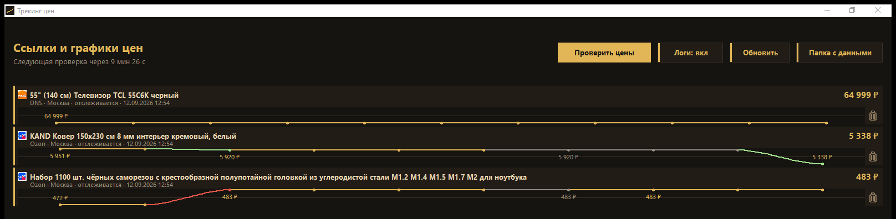

# Трекинг цен

Локальный бот для Windows: следит за ценами на **DNS**, **Ozon** и **Яндекс.Маркете**, рисует график в окне на компьютере и пишет в Telegram, когда цена изменилась.



На снимке три карточки. Телевизор без изменения — бронзовая горизонталь. Ковёр подешевел с 5 920 до 5 338 ₽ — зелёная кривая. Саморезы чуть выросли до 483 ₽ — короткий красный участок, дальше бронза.

## Что делает бот

- Принимает ссылку на карточку товара в личке Telegram.
- Открывает страницу в отдельном профиле Chrome через своё расширение и читает цену, как её видит человек. На Ozon берёт ценник **«с Ozon банком»** / «с Ozon Картой», а не цену «с другими банками» и не первое крупное число на странице.
- Пишет каждый замер в историю: на графике видно, что проверка прошла, даже если число не сдвинулось.
- **Первую найденную цену в чат не шлёт** — это база.
- **Любое отличие от предыдущей известной цены** сразу уходит в Telegram: было / стало, разница и процент. Если товар пропал с витрины, пишет об этом отдельной строкой.
- В окне на компьютере видны **все** отслеживаемые ссылки. В Telegram каждый видит и снимает **только свои**.

Лимит: не больше 10 активных ссылок на одного пользователя Telegram.

## Как пользоваться в Telegram

Напишите боту в личку (группы он не обслуживает).

| Действие | Как |
| --- | --- |
| Добавить товар | Прислать ссылку на карточку DNS, Ozon или Яндекс.Маркета. Короткие ozon.ru/t/… тоже принимаются. |
| Список | `/list` — свои ссылки и кнопки корзины |
| Снять | `/del номер` из `/list`, либо кнопка 🗑 |
| Справка | `/start` или `/help` |

После добавления бот напишет магазин, город и как часто будет ходить на эту карточку.

## Окно на компьютере

Заголовок «Трекинг цен». Под ним статус («Следующая проверка через…») и кнопки:

- **Проверить цены** — обойти все активные товары сейчас, не дожидаясь таймера.
- **Логи** — включить подробную запись в `data/bot.log`.
- **Обновить** — перечитать список из базы.
- **Папка с данными** — открыть каталог с базой и профилем Chrome.

Каждая строка: название, магазин, город, статус, время проверки, текущая цена, график и урна. Урна снимает товар **у всех** подписчиков (если их несколько, окно спросит подтверждение).

Цвета графика — для покупателя:

- **зелёный** — цена упала;
- **красный** — цена выросла;
- **бронза** — без изменения или единственный замер;
- **серый** — цена на странице не нашлась, на графике остаётся последняя известная.

Линии между точками — кубики Безье, без излома на узле. Подпись появляется на смене цены, а не на каждом одинаковом замере.

## Как часто ходит за ценой

Интервал задан в коде, не в `.env`.

| Магазин | Интервал |
| --- | --- |
| Ozon | каждые 20 минут |
| DNS | раз в сутки |
| Яндекс.Маркет | раз в сутки |

Между карточками внутри цикла пауза `FETCH_GAP` (по умолчанию 45 с), за один проход не больше `FETCH_PER_CYCLE` товаров (по умолчанию 8). Автоцикл просыпается по самому короткому магазину — сейчас это 20 минут из‑за Ozon.

DNS и Маркет при частых заходах показывают защиту. Если сайт ответил баном или капчей, цикл этого магазина останавливается, предохранитель молчит `CIRCUIT_COOLDOWN` (по умолчанию 45 мин). Заглушку Ozon «нет соединения» можно пройти кнопкой «Обновить страницу» в окне Chrome.

## Как устроено внутри

Цены читает **расширение Chrome**, а не CDP на вкладке магазина. Иначе Ozon показывает «Похоже, нет соединения». Удалённая отладка нужна только чтобы один раз поставить распакованное расширение в профиль `data/chrome-plain`. Личный Chrome бот не трогает.

Данные — SQLite (`bot.db` в корне проекта). Товары общие: два человека могут следить за одной карточкой, история цен одна. Подписки раздельные.

Локальная страница `http://127.0.0.1:8080` — операторский список всех заявок, слушает только loopback.

Стек: Go 1.25, окно — [walk](https://github.com/lxn/walk), Telegram — telebot, SQLite без CGO (`modernc.org/sqlite`).

## Установка на Windows

Нужны Go и Google Chrome (или Chrome for Testing, если бот уже клал его в `%LOCALAPPDATA%\price-tracking-bot`).

1. Скопируйте `.env.example` в `.env` и впишите токен от [@BotFather](https://t.me/BotFather).
2. Запустите `install-autostart.ps1`: соберёт `price-tracking-bot.exe`, ярлык на рабочий стол и в автозагрузку.
3. Либо соберите сами и стартуйте через `start.vbs` (тихо, из трея):

```powershell
$env:GOTOOLCHAIN = "local"
$env:CGO_ENABLED = "0"
go build -o price-tracking-bot.exe ./cmd/bot
cscript //nologo start.vbs
```

Полезные переменные в `.env` (полный список — в `.env.example`):

| Переменная | Смысл |
| --- | --- |
| `DATABASE_PATH` | файл SQLite, по умолчанию `bot.db` |
| `DEFAULT_CITY` | город для цены DNS, по умолчанию `moscow` |
| `ALLOWED_USERS` | Telegram id через запятую; пусто — пускать всех |
| `UI_ADDR` | локальная страница, `off` чтобы не поднимать |
| `GUI` | `off` — только Telegram и веб |

Токен и `*.exe` в git не кладутся.

## Уведомление в Telegram

Текст собирается одинаково для всех магазинов: стрелка роста или падения, ссылка на товар, «было» / «стало», абсолютная разница и процент. Если предыдущей цены ещё не было (в том числе серый ноль «цена не найдена»), письмо не уходит. Смена только наличия при той же цене тоже считается изменением.
